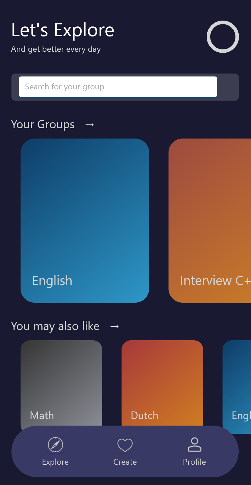
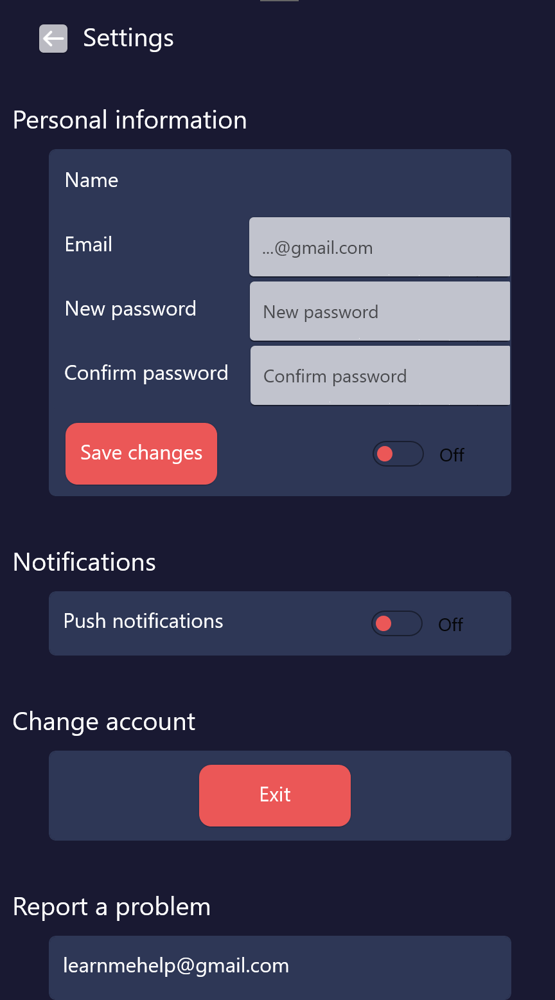
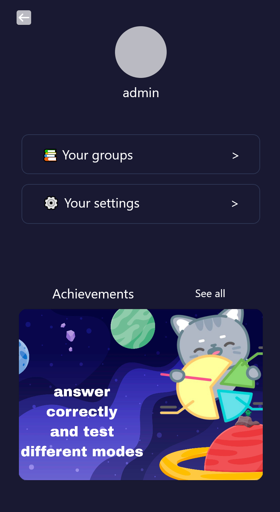

# Проект "LernMe"

## Краткое описание:

"LernMe" - это мобильное приложение для операционной системы Android, созданное с целью помочь пользователям в эффективном изучении и запоминании различных тем и материалов. Независимо от того, изучаете ли вы новые слова для языкового курса, термины для профессионального обучения или подготавливаетесь к экзаменам, "LernMe" предоставляет интуитивно понятный и гибкий инструмент для создания и изучения флеш-карточек.

## Функциональность приложения:

- **Регистрация и аутентификация пользователей:** Простой процесс регистрации позволяет пользователям создать свой аккаунт и войти в него для доступа ко всем функциям приложения.

- **Создание и редактирование флеш-карточек:** Пользователи могут легко создавать флеш-карточки, добавляя вопросы и соответствующие ответы. Редактирование карточек также доступно для обновления или исправления информации.

- **Организация карточек в группы:** Для удобства пользователей карточки могут быть организованы в группы по различным темам или предметам. Это помогает структурировать материал и делает его легче управляемым.

- **Различные режимы изучения:** Приложение предоставляет разнообразные режимы изучения, чтобы соответствовать потребностям и предпочтениям пользователей. Например, режим "Блиц" для изучения на время или режим "До последнего" для повторения материала до полного усвоения.

- **Дополнение "RoadMap":** Для студентов и профессионалов, которые готовят курсовые или исследовательские работы, "RoadMap" предоставляет структурированный подход к подготовке и планированию материала.

## Краткий обзор:

https://github.com/user-attachments/assets/a89773cc-69f0-4904-ada1-7fd698f2d176

